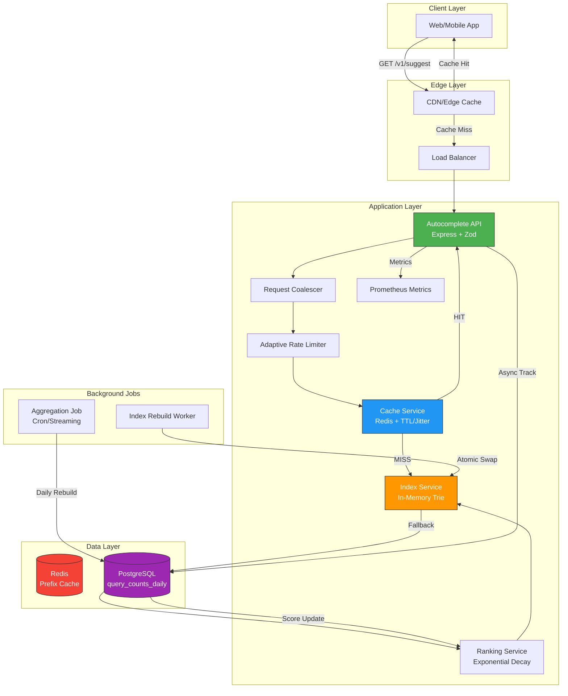

## Arquitectura de Componentes

### Key Decisions

1. **Cache-aside**: Redis serves as the first line of defense for "hot" prefixes.
2. **In-memory Trie**: O(k) lookup with no DB queries for the majority of requests.
3. **Atomic Rebuild**: New index is built in the background and swapped in without downtime.
4. **Adaptive Rate Limiting**: Stricter limits for Zipf-distributed prefixes.
5. **Request Coalescing**: Prevents the "thundering herd" problem for ultra-hot prefixes.
